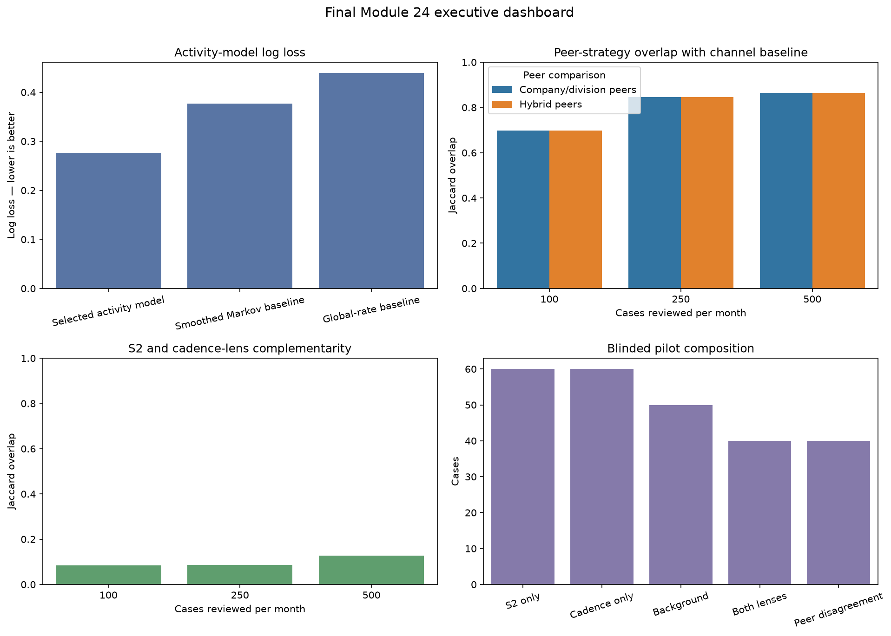
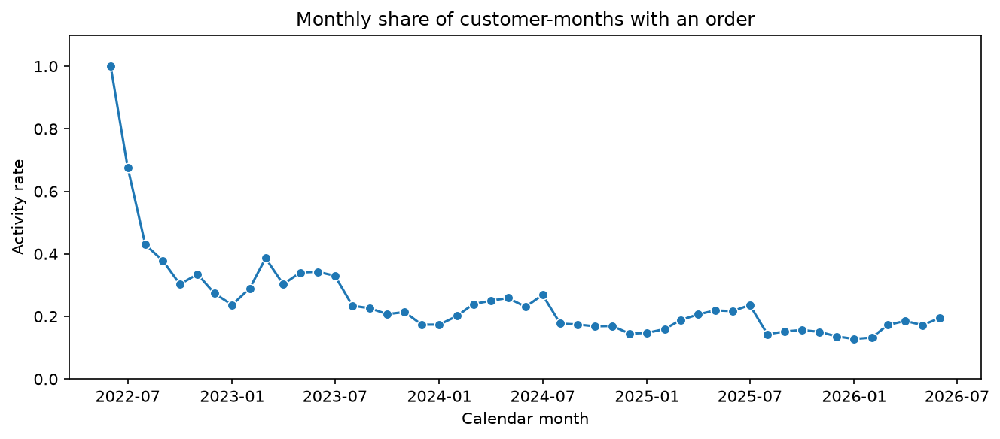

# Module 24 Final Report

## Executive Summary

This capstone asks a practical question: when a commercial team can investigate only a limited
number of customer situations each month, which cases should it review first? The work evaluates
two complementary **investigation lenses**:

1. a business-friendly S2 deviation score, which compares a customer with its history and peers; and
2. a hurdle/cadence forecast, which estimates next-month activity and the likely active-month
   pattern.

The selected forecasting model performs better than the disclosed simple baselines on the untouched
January--June 2026 period. The S2 and cadence queues select largely different cases at the same
capacity. The current evidence supports a mixed, blinded 250-case review. Automated action and
commercial-value estimation are outside the current evaluation.

### Evidence scope

- **Technical evidence:** forecasting performance, queue stability, and queue overlap.
- **Operational recommendation:** combine both lenses in a fixed-capacity human-review pilot.
- **Outside the current evaluation:** anomaly correctness, reviewer usefulness, adoption, ROI,
  and financial impact.

The dashboard summarizes the four comparisons that determine the recommendation. Detailed values,
definitions, and uncertainty estimates appear in the modeling and findings sections below.

## Problem Statement

Commercial teams have limited capacity to investigate customer behavior. This project prioritizes
customer alert episodes: a sequence of related customer-month signals is reviewed as one work item.
S2 measures deviation from a customer's history and comparable customers. The hurdle/cadence model
predicts next-month activity and, conditional on activity, the expected activity pattern. Both are
investigation signals, not churn labels, anomaly labels, or automated decisions.

## Data Acquisition and Preparation

The confidential source is a customer-month panel assembled from ERP order-line and customer-master
records for one industrial partner. The deliverable contains no raw records, identifiers, or
commercial values. Authorized local checkpoints provide a reproducible rerun boundary; executed
notebooks contain aggregate evidence sufficient for review.

Each customer-month is checked for a valid month key and deterministic order. Duplicate
customer-months and invalid keys are removed; boolean flags and numeric values are normalized.
Aggregate notebook audits report grain, coverage, activity rate, missingness, and score
completeness. The feature contract uses only as-of behavioral cadence: activity rates,
order-frequency summaries, inactivity duration, year-over-year availability, non-monetary rates,
tenure, and calendar phase. Monetary values, current lifecycle fields, operational status fields,
and peer assignments are excluded from prediction.

The panel's monthly activity rate falls steeply as the customer base is backfilled during 2022, then
settles near 0.15--0.25 from 2023 onward with a mild seasonal shape. This level sets the class
balance for the next-month activity target and is why probability quality, not accuracy, drives
model selection.

## Modeling and Evaluation

Stage 1 compares logistic regression and histogram gradient boosting with smoothed-Markov and
global-rate baselines. Histogram gradient boosting is tuned on four expanding chronological folds
from the training period only. The calibration window determines whether isotonic calibration meets
the disclosed log-loss and Brier gate. The untouched January--June 2026 window is the primary
evaluation. Stage 2 is a fixed-design active-month pattern classifier evaluated against a majority
baseline. Channel, company/division, and hybrid S2 peer definitions are compared at fixed monthly
capacities of 100, 250, and 500 cases.

### Temporal validation design

The model only sees information available at the end of month *t* when it predicts month *t+1*.
Hyperparameters are selected with expanding chronological folds inside the training period. The
calibration window and the final January--June 2026 forward holdout remain unseen during that
selection. This prevents future observations from influencing past predictions and makes the
reported forward metrics the clearest technical evidence in the project.

<!-- METRICS_START -->
## Generated results

The modeling panel contains **564,144 customer-months**
and **17,128 customers**, ending in
**2026-06**.

### Hurdle/cadence forecast

The selected operational activity model is **`hist_gradient_boosting_raw`**. The table reports the
two candidate classifiers on the same forward window alongside the two disclosed same-target
baselines; log loss is the primary selection metric because the workflow needs usable probabilities,
not only a yes/no label.

| Model | Log loss | ROC-AUC | Average precision | F1 | Balanced accuracy |
|---|---:|---:|---:|---:|---:|
| Selected activity model (histogram gradient boosting) | 0.2765 | 0.8874 | 0.6523 | 0.5480 | 0.7063 |
| Logistic regression candidate | 0.2967 | 0.8759 | 0.6219 | 0.5560 | 0.7241 |
| Smoothed activity Markov | 0.3767 | 0.6931 | 0.3100 | 0.0000 | 0.5000 |
| Global activity rate | 0.4393 | 0.5000 | 0.1538 | 0.0000 | 0.5000 |

Conditional active-pattern accuracy is **0.6021** versus a
**0.4863** majority baseline; macro-F1 is
**0.4318**. These metrics evaluate self-supervised next-month behavior.
Commercial anomaly correctness is evaluated separately.

### Forward uncertainty

Customer-clustered nonparametric bootstrap on the fixed forward holdout (1,000
resamples; seed 42) keeps every sampled customer's six forward
months together. Negative log-loss differences and positive ROC-AUC differences favor the selected
model.

| Comparison | Log-loss difference, 95% CI | ROC-AUC difference, 95% CI |
|---|---:|---:|
| Selected minus smoothed_activity_markov | -0.1002 [-0.1028, -0.0975] | 0.1943 [0.1898, 0.1982] |
| Selected minus global_activity_rate | -0.1628 [-0.1672, -0.1586] | 0.3874 [0.3837, 0.3910] |

These intervals quantify sampling uncertainty for this historical forward window. Anomaly
correctness, commercial usefulness, and future financial value require commercial-review evidence.

### Peer strategy at fixed monthly capacity

| Cases/month | Channel vs company/division Jaccard | Channel vs hybrid Jaccard |
|---:|---:|---:|
| 100 | 0.6973 | 0.6973 |
| 250 | 0.8450 | 0.8450 |
| 500 | 0.8634 | 0.8645 |

The company/division peer cell is usable and non-sparse for
**98.90%** of forward rows. Its changed cases
must be reviewed before replacing channel.

### S2 versus hurdle queue

| Cases/month | Jaccard | Shared customer-months across six months |
|---:|---:|---:|
| 100 | 0.0850 | 94 |
| 250 | 0.0858 | 237 |
| 500 | 0.1272 | 677 |

At 250 cases/month the queues overlap at only
**0.0858**. This provides
evidence of complementarity and supports sampling both tails. Tail usefulness requires reviewer
outcomes.

### Alert episodes and pilot

The episode layer removes repeated monthly work items before handoff. The blinded pilot contains
**250 cases** across S2 only (60), cadence only (60), background sample (50), both lenses agree
(40), and peer-definition disagreement (40). The deterministic capacity fill stratum drew no cases
at this capacity. Inclusion probabilities are retained in the private allocation key.

The activity forecast answers the operational question of next-month ordering behavior; its
metrics are interpreted only for that self-supervised prediction target.
<!-- METRICS_END -->

## Findings

- The selected model improves technical next-month activity forecasting over the disclosed
  same-target baselines on the untouched forward period.
- Channel S2 is the clearest business-friendly investigation lens; company/division remains subject to
  commercial review of changed cases.
- The two lenses surface largely different capacity-bounded queues, supporting a mixed pilot.

## Recommendations

- Operate channel S2 and hurdle/cadence as complementary, capacity-bounded investigation lenses.
- Use the blinded 250-case review as the decision gate. Process automation or replacement requires
  commercial-review evidence in addition to technical metrics.
- Preserve the public hash-only manifest and curated ZIP with each final handoff.

## Next Steps

1. Complete blinded review for usefulness, novelty, actionability, review effort, and operating fit.
2. Estimate outcomes with the private inclusion probabilities under the documented sampling design.
3. Use commercial-review evidence before making any adoption, ROI, or financial-impact claim.

## Claim Boundary

The work covers temporal predictive performance, queue sensitivity, and complementarity. Anomaly
correctness, commercial precision, adoption, ROI, and financial impact remain subjects for the
commercial validation stage.
